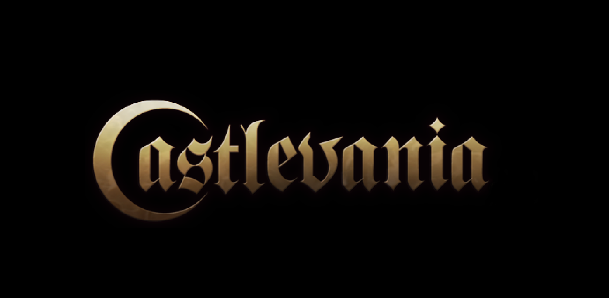

# Castlevania

Link play : https://viet281101.github.io/CastlevaniaJS/

[Demo.webm](https://github.com/Viet281101/CastlevaniaJS/assets/77735678/9c2a3aca-b8e1-4be8-a5fc-899a3d24f653)

### Sources:
1) Musics:
   - Main Menu Music : [Viktor Kraus - Into the Ruins](https://opengameart.org/content/into-the-ruins)
   - Level 1 Music : [Ost : Menu - Castlevania: Lords of Shadow 2 OST](https://www.youtube.com/watch?v=lLP6b6mOolw&ab_channel=e105beta)
   - Level 2 Music : [Castlevania the Adventure ReBirth Soundtrack - Vampire Killer (Stage 6)](https://www.youtube.com/watch?v=MqlonUJTNtU&list=PLB1mBUgyWbK3SSmd7_ELjPat6xQXeXqDH&index=59&ab_channel=JamesAlbert)
   - Level 2 Music Boss : [Castlevania the Adventure ReBirth Soundtrack - Reincarnated Soul (Stage 1)](https://www.youtube.com/watch?v=ZV_HESv4mfs&list=PLB1mBUgyWbK3SSmd7_ELjPat6xQXeXqDH&index=55&ab_channel=JamesAlbert )
   - Death Music : [Castlevania: Order of Ecclesia music - Game Over](https://www.youtube.com/watch?v=6Q_gXqCY_nM&ab_channel=Bramblekit)

2) Images:
   - Tiles Assets Packs : [2D Environment Platformer Asset Pack: Castle of Despair](https://brullov.itch.io/2d-platformer-asset-pack-castle-of-despair)
   - Tiles Assets Packs2: [https://www.spriters-resource.com/fullview/3460/?source=genre]
   - Player : [Sprite Héros (Alucard)](https://www.castlevaniacrypt.com/wp-content/img/sotn/sprites/alucard.png)
   - Butterfly : [OpenGameArt.org Forest monsters pack](https://opengameart.org/content/forest-monsters)
   - Ghost & Fire Skull: [OpenGameArt.org Gothicvania monsters packs](https://opengameart.org/content/gothicvania-patreons-collection)
   - Bitterfly : [https://www.castlevaniacrypt.com/wp-content/img/sotn/sprites/bitterfly.png]

3) Fonts:
   - Castlevania Font : download from [here](https://hyperpix.net/fonts/castlevania-font/)
     

### Participants:
- Viet Nguyen 
- @D-TheProgrammer
- Wilfried Ben Brahim
- Jonny Mathanaruban
