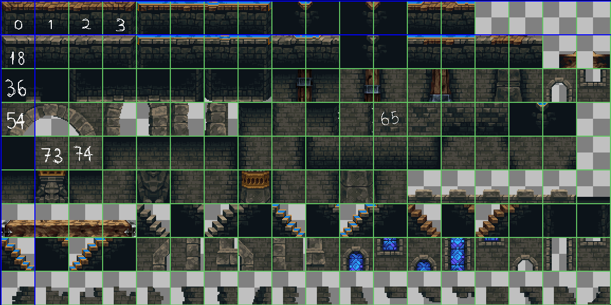

# TODO liste

Voici une checklist pour les choses à faire

### TODO liste, les trucs à faire:

1. Compléter de concevoir les niveau 1 (**lvl1/**) et 2 (**lvl2/**) du jeu
   - [x] Disposer les tiles  sur l'écran de jeu (Référer part 3 et 4 de cette YouTube tuto [How To Write A JavaScript Platformer](https://www.youtube.com/playlist?list=PLcN6MkgfgN4CpMUgWEM5d70ANMWgcmBp8))
   - [x] Faire l'animation des tiles et décorations (Référer [Tiles Animation](https://www.youtube.com/watch?v=AQABpi9nLfU&t=41s))
   - [x] Faire animation pour le personnage (Référer part 5 de cette YouTube tuto [How To Write A JavaScript Platformer](https://www.youtube.com/playlist?list=PLcN6MkgfgN4CpMUgWEM5d70ANMWgcmBp8))
   - [x] Créer le Hitbox et HurtBox des characters
   - [x] Créer des ennemis (Référer cette vidéo tuto [Simple Enemy AI in JavaScript](https://www.youtube.com/watch?v=zbqwFb8DJgQ))
   - [ ] Mettre des sprites et annimations sur tous les perso et ennemie du jeux
   - [ ] Créer la musique de fond pour chaque niveau
   - [ ] Créer GUI pour les niveaux (HP bar, barre d'endurence, etc)
   - [ ] (Option) Créer des décoration pour les niveaux du jeu (dans ./assets/Decorations/)
   - [ ] (Option) Créer une cinématique supplémentaire entre les niveaux
   - [ ] (Option) Ajouter des effets graphiques, des shaders pour chaque niveau du jeu
   - [ ] Crée les conditions pour terminer un niveau et passer à un autre niveau (lvl1 -> lvl2)

2. Compléter le menu pause du jeu (par exemple, appuyer le bouton "**P**" arrêtera le jeu et afficher l'écran du menu pause avec les boutons **Continuer**, **Setting**, **Quit**)
   - [ ] completer le fichier "js/menu/pause.js", ajouter des boutons
   - [ ] ajouter une touche pour appeler l'écran pause dans le jeu

3. Compléter le système de menu du projet
   - [x] compléter le fichier settings.js
   - [ ] ajout de la posibilité de gérer les raccourir, clés controls du projet

4. Créer plus des niveaux du jeu et des combats de boss
   - [ ] js/game/lvl3/
   - [ ] js/game/boss_fight/
